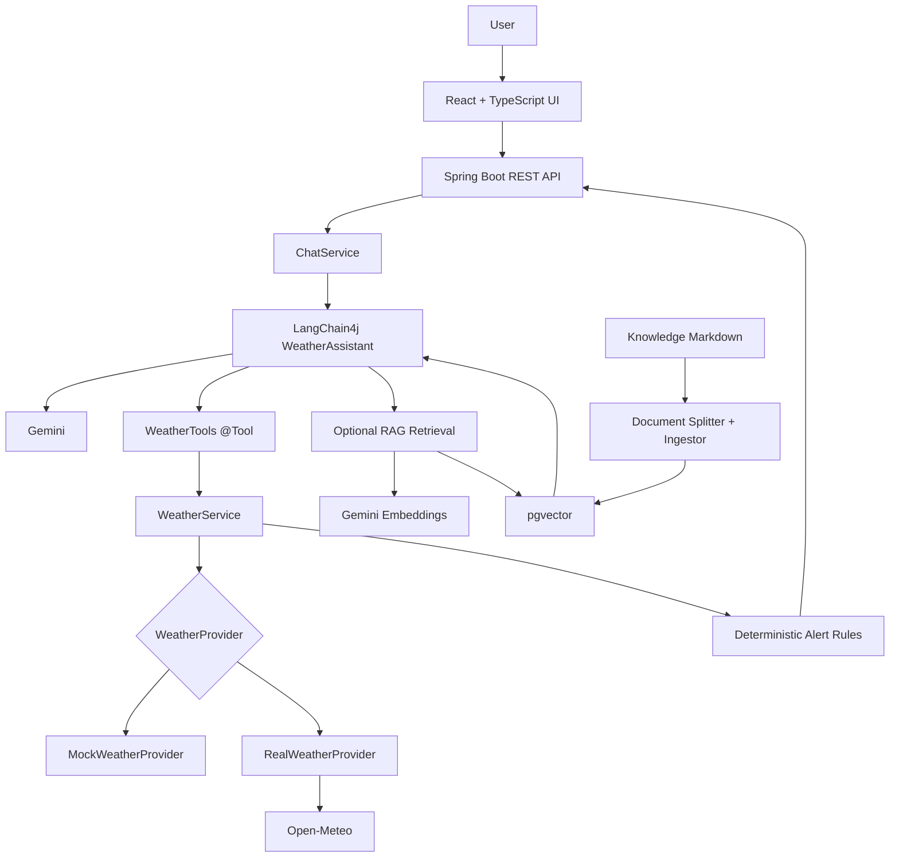
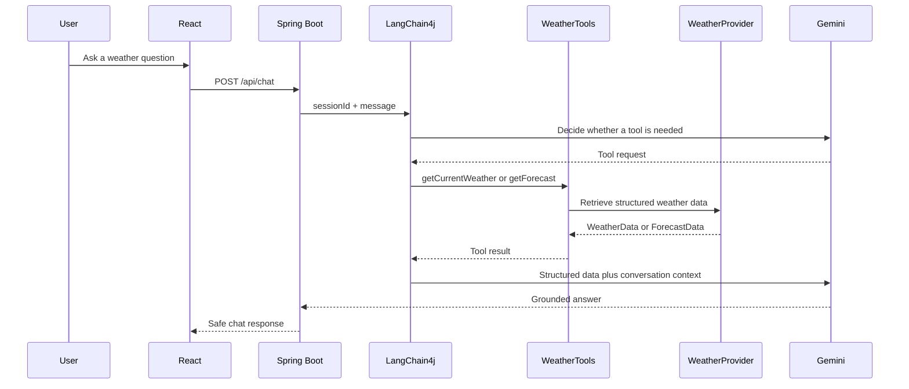

# WeatherGPT

WeatherGPT is an AI weather and disaster intelligence assistant built as an understandable Spring Boot monolith with a React frontend.

It is intentionally more than a weather dashboard:

```text
Natural-language question
        |
        v
LangChain4j + Gemini
        |
        +--> Java weather tools --> Mock or live weather provider
        |
        +--> RAG retrieval ------> Safety and agriculture knowledge
        |
        +--> Deterministic rules -> Weather alerts
        |
        v
Grounded weather explanation and personalized advisory
```

> Current status: runnable portfolio MVP. Mock weather works without external accounts. Gemini, pgvector, and Docker are configured as opt-in integrations and require local services or credentials.

## Why This Project Is Different

A conventional weather app usually follows `weather API -> dashboard`. WeatherGPT separates responsibilities:

- Weather facts come from a provider or Java tool, never from model imagination.
- Safety and agriculture guidance comes from retrieved knowledge documents.
- Severe-weather alerts come from deterministic thresholds.
- Gemini explains the combined context in natural language.
- The React UI labels demo data clearly.

## Features

- Current weather, multi-day forecast, historical demo data, and weather alerts
- Configurable mock provider for offline development
- Optional Open-Meteo live provider behind the same `WeatherProvider` interface
- Heavy rain, high wind, extreme heat, and thunderstorm alert rules
- LangChain4j AI Service with Gemini integration
- LangChain4j `@Tool` methods for current weather, forecasts, and alerts
- Session-based chat memory
- Optional markdown RAG pipeline with Gemini embeddings and PostgreSQL/pgvector
- Farmer Mode advisory with crop, growth stage, and soil context
- English and Hindi response selection
- Recharts rainfall trend visualization
- Spring Boot Actuator health endpoint
- Docker Compose configuration for PostgreSQL/pgvector, backend, and frontend

## Architecture



### Chat request flow



## Technology Stack

| Area | Technology |
| --- | --- |
| Backend | Java 21, Spring Boot 3.5.6, Spring Web, Actuator |
| AI | LangChain4j 1.20.1, Google Gemini |
| RAG | Gemini embeddings, LangChain4j retrieval, PostgreSQL, pgvector |
| Frontend | React, TypeScript, Vite, Recharts |
| Weather | Mock provider and optional Open-Meteo provider |
| Testing | JUnit 5, Spring Boot Test |
| Packaging | Maven, npm, Docker Compose |

## Quick Start: Mock Mode

### Prerequisites

- Java 21
- Maven 3.9+
- Node.js 22+
- npm

### Start the backend

```bash
cd backend
mvn spring-boot:run
```

The backend runs at `http://localhost:8080`.

### Start the frontend

Open a second terminal:

```bash
cd frontend
npm install
npm run dev
```

Open `http://localhost:5173`.

The frontend proxies `/api` requests to the backend. Mock weather is enabled by default and is marked as demo data.

## Gemini and RAG Mode

Copy the example environment file and add your own Gemini key:

```bash
copy .env.example .env
```

Set these values in `.env`:

```dotenv
GEMINI_API_KEY=your_key_here
GEMINI_ENABLED=true
RAG_ENABLED=true
WEATHER_PROVIDER=mock
```

Start PostgreSQL with the pgvector image before enabling RAG. The RAG pipeline loads documents from `backend/src/main/resources/knowledge`, splits them, creates embeddings, stores vectors, and retrieves relevant chunks for the AI Service.

Do not commit `.env` or API keys.

## Docker Compose

With Docker Desktop running:

```bash
docker compose up --build
```

Services:

- Frontend: `http://localhost:5173`
- Backend: `http://localhost:8080`
- PostgreSQL/pgvector: `localhost:5432`

The Compose stack reads `GEMINI_API_KEY`, `GEMINI_ENABLED`, and `RAG_ENABLED` from the shell or `.env` file.

## Configuration

| Variable | Default | Purpose |
| --- | --- | --- |
| `WEATHER_PROVIDER` | `mock` | Use `mock` for offline demo data or `real` for Open-Meteo |
| `GEMINI_ENABLED` | `false` | Enables the LangChain4j Gemini AI Service |
| `GEMINI_API_KEY` | empty | Backend-only Gemini credential |
| `GEMINI_MODEL` | `gemini-3.8-flash` | Gemini chat model |
| `RAG_ENABLED` | `false` | Enables Gemini embeddings and pgvector retrieval |
| `DATABASE_HOST` | `localhost` | PostgreSQL host for RAG |
| `DATABASE_PORT` | `5432` | PostgreSQL port |
| `DATABASE_NAME` | `weathergpt` | PostgreSQL database |
| `DATABASE_USERNAME` | `weathergpt` | PostgreSQL username |
| `DATABASE_PASSWORD` | `weathergpt` | PostgreSQL password |

## REST API

| Method | Endpoint | Description |
| --- | --- | --- |
| `GET` | `/api/health` | Application health |
| `GET` | `/api/weather/current?location=Delhi` | Current weather |
| `GET` | `/api/weather/forecast?location=Delhi&days=5` | Forecast |
| `GET` | `/api/weather/alerts?location=Delhi` | Deterministic alerts |
| `GET` | `/api/weather/history?location=Delhi` | Historical demo observations |
| `POST` | `/api/chat` | Gemini/LangChain4j chat |
| `POST` | `/api/advisory/farmer` | Crop advisory |
| `GET` | `/api/rag/search?question=lightning safety` | RAG similarity search |
| `GET` | `/actuator/health` | Spring Boot health details |

Example chat request:

```json
{
  "sessionId": "demo-1",
  "message": "Will it rain tomorrow in Delhi?",
  "language": "en"
}
```

Example farmer request:

```json
{
  "location": "Delhi",
  "crop": "Wheat",
  "growthStage": "Flowering",
  "soilType": "Loamy",
  "language": "en"
}
```

## Demo Scenarios

1. Ask: `What is the weather in Delhi tomorrow?` to demonstrate forecast tool calling.
2. Ask: `What precautions should I take during lightning?` to demonstrate safety knowledge retrieval.
3. Open Farmer Mode, choose `Wheat`, and request an advisory.
4. Switch the chat language to Hindi and ask: `कल दिल्ली में बारिश होगी?`.
5. Inspect the rainfall trend and compare the clearly labeled demo observations.

## Testing

Backend:

```bash
cd backend
mvn clean test
```

Frontend:

```bash
cd frontend
npm run build
```

Tests do not require a real Gemini API key. External Gemini, Open-Meteo, PostgreSQL, and Docker behavior must be tested in an environment where those services are available.

## Project Structure

```text
backend/
  src/main/java/com/weathergpt/
    ai/           LangChain4j AI Service
    config/       Gemini and RAG configuration
    controller/   REST endpoints
    model/        Weather and alert records
    rag/          Document ingestion and retrieval
    service/      Chat and advisory services
    tools/        LangChain4j weather tools
    weather/      Provider abstraction and implementations
  src/main/resources/knowledge/
frontend/
  src/components/ Weather chart
  src/App.tsx     Dashboard, chat, and Farmer Mode
docker-compose.yml
.env.example
```

## Safety and Data Rules

- Current and future weather must come from a weather provider.
- Alerts are generated by deterministic rules or official provider data.
- Gemini must not invent live weather facts.
- Demo data is labeled and must not be presented as real observations.
- Serious weather situations should defer to official emergency instructions.
- API keys remain on the backend and are never sent to React.

## Limitations and Next Improvements

- Historical data is currently clearly labeled demo data.
- The Open-Meteo provider does not yet implement live historical observations.
- RAG requires PostgreSQL/pgvector and a Gemini key; it is disabled by default.
- Authentication, rate limiting, production monitoring, and official alert feeds are future work.
- A production deployment should pin dependency versions and add browser-level tests.

## Publish to GitHub

This workspace is initialized as a local Git repository. After creating an empty GitHub repository, run:

```bash
git branch -M main
git add .
git commit -m "Build WeatherGPT AI weather assistant"
git remote add origin https://github.com/YOUR_USERNAME/YOUR_REPOSITORY.git
git push -u origin main
```

Review `.env.example` before pushing. Never add `.env`, API keys, `node_modules`, or Maven `target` output.

## License

This project is intended as a portfolio and hackathon project. Add a license before public distribution if required by your use case.
